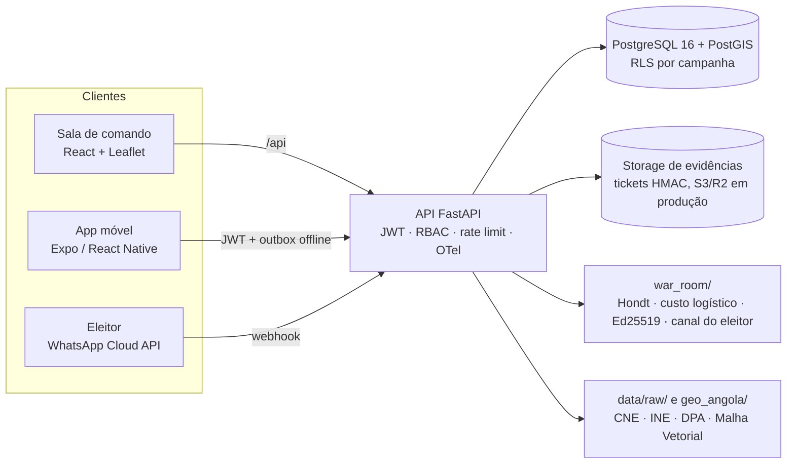

# GPS de Marketing Político — Angola 2027

Plataforma B2B de inteligência territorial para campanhas eleitorais angolanas: zonamento por margem, simulador do método de Hondt, operação de campo offline, apuramento paralelo com assinatura digital e canal do eleitor por WhatsApp.

[](https://github.com/jacaunaigor-ig/angola/actions)

## Princípios

1. **Honestidade dos dados.** Todo número mostra a origem: `OFICIAL` (CNE, INE), `ESTIMADO` (projecção documentada), `SIMULADO` (demonstração ou cenário) ou `PROVISORIO`. Nada é inventado para preencher lacunas; as lacunas ficam declaradas nos próprios ficheiros e no painel.
2. **Privacidade (Lei n.º 22/11).** Coordenadas de campo são perturbadas em ~110 m, não se gravam nomes, BI nem preferências individuais, e o canal do eleitor **nunca** consulta o caderno eleitoral. Telefones são mascarados e guardados só como hash.
3. **IA propõe, pessoa decide.** Discursos são sempre `RASCUNHO`; promessas saem marcadas `[PROMESSA — REVISAR]` e exigem aprovação do comité.
4. **Matemática auditável.** Zonamento: `margem = % partido − % oponente` (≥ 15 bastião, ≤ −15 oposição). Prioridade: `(potencial × competitividade Hondt) ÷ custo logístico^0,65`. As fórmulas aparecem na interface.
5. **Prova com valor jurídico.** Cada ata é assinada com Ed25519 no aparelho do delegado, leva o SHA-256 da fotografia e é verificada pela API antes de entrar.

## Arquitectura



Detalhes e decisões em [docs/arquitetura.md](docs/arquitetura.md). Superfícies de operação (consulta CNE, sala autenticada, laboratório `?lab=1`) em [docs/produto.md](docs/produto.md).

## Arranque rápido

Requisitos: Python 3.11+, Node 20+ e, para as rotas de campanha, PostgreSQL 16 com PostGIS.

```bash
# 1. API (as rotas de cartografia, Hondt e série histórica funcionam sem base de dados)
python -m venv .venv && source .venv/bin/activate      # Windows: .venv\Scripts\Activate.ps1
pip install -r backend/requirements-dev.txt
cp .env.example .env                                    # Windows: copy .env.example .env
cd backend && PYTHONPATH=.. uvicorn app.main:app --port 8000
```

```powershell
# Windows (PowerShell)
$env:PYTHONPATH = "C:\caminho\para\projeto_angola"
cd backend; python -m uvicorn app.main:app --port 8000
```

```bash
# 2. Sala de comando
cd web && npm install && npm run dev                    # http://localhost:5173
```

Execute o `uvicorn` a partir de `backend/` com `PYTHONPATH` na raiz. O protótipo Streamlit está em `prototipo/` e não é o cliente operacional.

Com Docker: `cp .env.example .env`, defina `POSTGRES_PASSWORD` e `JWT_SECRET_KEY`, depois `docker compose up --build`. A sala de comando fica em `:3000`, a API em `:8000`.

## O que a plataforma faz

| Área | Entrega | Onde |
| --- | --- | --- |
| Território | Zonamento por margem, contorno nacional, malhas DPA 2016 (18) e 2024 (21) | `web/`, `GET /api/territorio/*` |
| Motor político | Hondt por círculo (5 cadeiras), votos para virar a cadeira, simulador com choques ±30 % | `war_room/motor_hondt.py`, `/api/eleicoes/hondt-*` |
| Priorização | Custo logístico por província integrado no score | `war_room/custo_logistico.py` |
| Histórico | Série nacional 2012–2022 com lacunas declaradas | `data/raw/serie_historica_eleicoes_cne.json` |
| Campo | Visitas offline com idempotência, outbox, geofence e jitter | `mobile/`, `/api/sincronizar-visitas` |
| Dia D | Ata com SHA-256 + Ed25519, evidência em storage desacoplado | `/api/dia-d/*`, `/api/evidencias/*` |
| Eleitor | Mesas de exemplo e queixas agregadas, sem caderno pessoal | `war_room/canal_eleitor.py`, `/api/whatsapp/*` |
| Comercial | Planos Municipal, Provincial e Nacional com entitlements | `/api/planos`, `war_room/planos_comerciais.py` |

## Testes e qualidade

```bash
python -m ruff check backend/app backend/tests war_room    # lint
python -m pytest backend/tests                              # contrato; integração se TEST_DATABASE_URL existir
cd web && npm run build                                     # compila a sala de comando
cd mobile && npm ci && npx expo export --platform android   # valida o bundle móvel
```

Os testes de integração exigem uma base PostGIS isolada cujo nome termina em `_test`. O CI corre tudo isto, mais a construção das imagens Docker.

## Estrutura

```text
backend/        API FastAPI (app/), testes e scripts de provisionamento
war_room/       Núcleo analítico em Python, sem dependência de web
web/            Sala de comando React (hooks/, components/, views/)
mobile/         App Expo: campo, Dia D, assinatura Ed25519, EAS (APK)
data/raw/       Dados com proveniência; ver data/raw/README.md
database/       Esquema PostGIS, seeds e migrations 01–11, por esta ordem
docs/           Arquitectura, roadmap, privacidade, legal, auditoria, demo
prototipo/      Protótipo Streamlit, fora do arranque operacional
arquivo/api-node/  API Node arquivada
```

## Documentação

- [Arquitectura e decisões](docs/arquitetura.md)
- [Roadmap e lacunas conhecidas](docs/roadmap.md)
- [Privacidade e retenção](docs/privacidade.md)
- [Marco legal eleitoral](docs/legal.md)
- [Auditoria técnica](docs/auditoria.md)
- [Guia de demonstração B2B](docs/demo_guide.md)
- [Dicionário de dados brutos](data/raw/README.md)
- [Como contribuir](CONTRIBUTING.md)
- [Licença](LICENSE)
- [Atribuições cartográficas](ATTRIBUTION.md)
